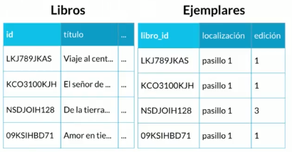
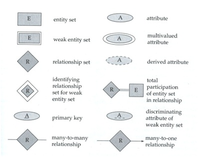

- [Curso de base de datos](#curso-de-base-de-datos)
  - [DBMS - Database management system](#dbms---database-management-system)
  - [RDBMS -Relational database management system](#rdbms--relational-database-management-system)
  - [Relational Data Base - RDB](#relational-data-base---rdb)
- [Diagramas entidad-relación](#diagramas-entidad-relación)
- [Diagramas UML (Unified Modeling Language)](#diagramas-uml-unified-modeling-language)
- [schema in postgres](#schema-in-postgres)
- [PostgreSQL](#postgresql)
  - [Instalación y configuración](#instalación-y-configuración)
  - [Archivos de configuración de postgres](#archivos-de-configuración-de-postgres)
  - [Creación de un nuevo rol](#creación-de-un-nuevo-rol)
  - [Iniciar sesión en el servidor postgres](#iniciar-sesión-en-el-servidor-postgres)
  - [Creación de una nueva bbdd](#creación-de-una-nueva-bbdd)
  - [- ### usando CREATE DATABASE](#---usando-create-database)
      - [**CREATE DATABASE Parameters**](#create-database-parameters)
  - [- ### CREATEDB](#---createdb)
      - [**createdb Command Line Arguments**](#createdb-command-line-arguments)
  - [Creación de una tabla - consultas básicas](#creación-de-una-tabla---consultas-básicas)
  - [PostgreSQL Data Types](#postgresql-data-types)
- [INDEX](#index)
  - [Comando psql - back slash](#comando-psql---back-slash)
  - [comandos SQL](#comandos-sql)
- [Anexo](#anexo)
  - [Workbench](#workbench)

# Curso de base de datos

## DBMS - Database management system

Significa "Sistema de gestión de bases de datos". En resumen, un DBMS es un programa de base de datos. Técnicamente hablando, es un sistema de software que utiliza un método estándar de catalogación, recuperación y ejecución de consultas sobre datos. El DBMS administra los datos entrantes, los organiza y proporciona formas para que los usuarios u otros programas modifiquen o extraigan los datos.

Algunos ejemplos de DBMS incluyen MySQL, PostgreSQL, Microsoft Access, SQL Server, FileMaker, Oracle, RDBMS, dBASE, Clipper y FoxPro. Dado que hay tantos sistemas de gestión de bases de datos disponibles, es importante que haya una manera de comunicarse entre ellos. Por esta razón, la mayoría del software de base de datos viene con una conectividad de base de datos abierta (ODBC) controlador que permite que la base de datos se integre con otras bases de datos. Por ejemplo, las instrucciones SQL comunes como SELECT e INSERT se traducen de la sintaxis patentada de un programa a una sintaxis que otras bases de datos pueden entender.

## RDBMS -Relational database management system

Significa "Sistema de gestión de bases de datos relacionales". Un RDBMS es un DBMS diseñado específicamente para bases de datos relacionales. Por lo tanto, los RDBMS son un subconjunto de DBMS.

Una base de datos relacional se refiere a un base de datos que almacena datos en un formato estructurado, utilizando filas y a la columnas. Esto facilita la localización y el acceso a valores específicos dentro de la base de datos. Es "relacional" porque los valores dentro de cada mesa están relacionados entre sí. Las tablas también pueden estar relacionadas con otras tablas. La estructura relacional permite ejecutar consultas en varias tablas a la vez.

Mientras que una base de datos relacional describe el tipo de base de datos que administra un RDMBS, el RDBMS se refiere a la base de datos programa sí mismo. Es el software que ejecuta consultas sobre los datos, incluida la adición, actualización y búsqueda de valores. Un RDBMS también puede proporcionar una representación visual de los datos. Por ejemplo, puede mostrar datos en tablas como un hoja de cálculo, lo que le permite ver e incluso editar valores individuales en la tabla. Algunos programas RDMBS le permiten crear formularios que pueden agilizar el ingreso, la edición y la eliminación de datos.

## Relational Data Base - RDB

Están formadas por:

1. entidad

Son objetos de ls bbdd que representa algo del mundo real. Las entidades tiene:

- `atributos`, es lo q las definen como entidad
  - un laptop (entidad) tiene atributos:
    - pantalla
    - color
    - año
    - antiguedad - se puede inferir a partir del año se representa en discontinuo
    - modelo
    - discoduro - attr multivaluado, puede haber más de un disco duro
    - método de entrada - attr compuesto pq tiene a su vez otros atributos como
      - trackpad
      - teclado
    - numero de serie - attri primary key - nos ayuda a identificar de manera única a la entidad


De primary key hay de dos tipo:

1. naturales => pq son inherentes a la entidad pej número de serie del laptop o el ISBAN de un libro
2. artificiañes => clave asignada de manera arbitraria como un campo id

Hay dos tipos de entidades:

1. fuertes => ueden existir por si mismas (se representan como un rectángulo)
2. débiles => necesitan a una entidad fuerte para existir (se representan con doble rectángulo)

Un ejemplo de esto puede ser entidad fuerte libro y ejemplar como entidad débil. Existe un libro en sí mismo pero para la entidad ejemplar necesitamos que exista el libro.

Las entidades débiles pueden serlo por:

1. identidad => se diferencian entre sí por la clave de su entidad fuerte, para diferenciar los diferentes ejemplares de libros necesitamos la PK de libro

2. existencia => aunq creemos una PK para los ejemplares y por lo tanto ya no son débiles por identidad siguen siendo débiles por existencia pq no puede existir un ejemplar sin un libro.



La nomenglatura para poder representar todo lo comentado es la siguiente



# Diagramas entidad-relación
https://www.lucidchart.com/pages/er-diagrams
# Diagramas UML (Unified Modeling Language)

https://www.lucidchart.com/pages/what-is-UML-unified-modeling-language

# schema in postgres

En postgres un esquema es un `namespace`que contiene objetos de bbdd como tablas, index, data type, function,... La misma bbdd puede contener varios esquemas y cada uno de estos esquemas puede contener un objeto, pej una tabla, cn el mismo nombre pero serán objetos diferentes pq perteneces a esquemas distintos. Entonces para acceder a esteos objeto deberemos utilizar el punto `esquema1.users` y `esquema2.users`.

Cada vez que creamos una bbdd, `CREATE DATABASE example_db;` y para listar todas las bbdd `\l`, postgres crea un esquema llamado `public` de tal manera que cuando creamos un objeto en la bbdd sin especificar el schema postgres lo crea en el esquema public.

Para crear nuestro propio schema hacemos `CREATE SCHEMA miSchema;` para listar los esquemas de esa bbdd `\dn`

Cuando accedemos a un objeto de la bbdd, postgres usa el llamado `schema search path` que es el listado de schemas de esa bbdd. Accederá al primer resultado que coincida, es decir si queremos acceder a una tabla sin especificar el esquema postgres accede al search path y busca una tabla cn ese nombre, el primer schema q contenga una tabla de ese nombre es la q será usada.

El primer schema del search path se le conoce como `current schema` así q cuando creamos un objeto sin especificar schema postgres lo crea en el current schema. Para conocer el current schema `SELECT current_schema();`

Si queremos ver el `schema search path` usamos la sentencia `SHOW search_path;`. El schema creado por nosotros no se incluye directamente en este path así que debemos hacerlo manualmente con la sentencia
`SET search_path TO miSchema, public;` siempre hay q añadir de nuevo el public

# PostgreSQL

Es un motor de bbdd.

Hay 3 conceptos importantes al rededor de las bbdd

1. bbdd/Lenguaje, manera de acceder a la información de la bbdd mediante lenguaje SQL
2. motor (postgreSQL), permite estructurar toda la información dentro de un servidor
3. servidor, computadora dnd se instala el motor

PostgreSQL usa como elemento central el objeto relacional en las bbdd, trasladó el concepto de OOP al mundo de las bbdd. PostgreSQL cumple las reglas ACID
A - atomicidad
C - consistencia
I - aislamiento
D - durabilidad

## Instalación y configuración

```
sudo apt update
sudo apt install postgresql postgresql-contrib

```

Por defecto, Postgres utiliza un concepto llamado “roles” para gestionar la autenticación y la autorización. Estos son, en algunos aspectos, parecidos a las cuentas normales de estilo Unix, pero Postgres no distingue entre los usuarios y los grupos, y en su lugar prefiere el término más flexible de “role”.

Tras la instalación, Postgres se configura para usar la autenticación ident. Esto significa que asocia los roles de Postgres con una cuenta de sistema Unix o Linux correspondiente. Si existe un rol dentro de Postgres, un nombre de usuario de Unix o Linux con el mismo nombre puede iniciar sesión ocupando ese rol.

El procedimiento de instalación creó en linux una cuenta de usuario llamada postgres, que se asocia con el rol predeterminado de Postgres. Para usar Postgres, puede iniciar sesión en esa cuenta.

para listar los users en linux podemos usar el comando `less /etc/passwd` y veremos cómo aparece, abajo de todo, el user postgtre

```
david@david-neon ~ ❯ sudo -i -u postgres
```

una vez con el user correcto entro en postgres tecleando psql

```
postgres@david-neon:~$ psql
```

y me sale un prompt del tipo. Para salir `\q`

```
postgres=# \q

```

y volvemos a linux.

Todo el proceso de acceso se puede simplificar con un solo paso

```
sudo -u postgres psql
```

también puedo hacer

```
david@david-neon ~ ❯ psql -U david
```

Esta instarucción funciona con mi user pq en la terminar estoy como usuario david, si intento lo mismo para entrar con el user postgres me arroja un error

```
david@david-neon ~ ❯ psql -U postgres
psql: error: falló la conexión al servidor en el socket «/var/run/postgresql/.s.PGSQL.5432»: FATAL:  la autentificación Peer falló para el usuario «postgres»
```

es pq quiero acceder desde la terminal de david a un user de postgres diferente, por eso primero debería cambiar, en la terminal al user postgres y luego entrar a postgres

```
david@david-neon ~ ❯ sudo -i -u postgres
postgres@david-neon:~$ psql -U postgres
```

Para saber la versión instalada de la consola de postgres (psql)

```
psql -V
```

Una vez dentro de la consola podemos ver la versión que está corriendo de postgres

```
select version();

                                                             version
----------------------------------------------------------------------------------------------------------------------------------
 PostgreSQL 12.8 (Ubuntu 12.8-1.pgdg20.04+1) on x86_64-pc-linux-gnu, compiled by gcc (Ubuntu 9.3.0-17ubuntu1~20.04) 9.3.0, 64-bit
(1 fila)

```

Los archivos de confiuguración está en

```
/etc/postgresql/14/main/postgresql.conf
```

Si queremos conectarnos a psql de una maquina remota debemos modificar ese archivo y especificar `listen_addresses='*'` para permitir todas las conexiones external al servidor o bien una lista de IPs concretas.

Para hacer conexiones remotas

```
psql -h <REMOTE HOST> -p <REMOTE PORT> -U <DB_USER> <DB_NAME>
psql -h <IP_Address> -p <port_no> -d <database_name> -U <DB_username>
```

El puerto por defecto dnd corre Postgres es el `5432`

Para saber qué puerto está configurado en los archivos de las versiones de postgres instaladas

```
david@david-neon ~ ❯ grep -H '^port' /etc/postgresql/*/main/postgresql.conf
/etc/postgresql/12/main/postgresql.conf:port = 5432
/etc/postgresql/14/main/postgresql.conf:port = 5433
```

Vemos que tengo las versiones 12 y 14 instaladas y ambas activas, el login por defecto lo hace al puerto 5432 y por lo tanto a la versión 12 si quisiera loguearme a la versión 14 tengo q especificar el puerto

```
postgres@david-neon:~$ psql --port 5433 -U postgres
```

## Archivos de configuración de postgres

Básicamente don 3 archivos:

1. postgresql.conf
2. pg_hba.conf
3. pg_indent.conf

Podemos realizar la consulta `show config_file;`para obtener la ruta de dónde se encuentra el archivo de configuraciones `postgresql.conf` de hecho en la ruta `/etc/postgresql/12/main/` es donde encontraremos los 3 archivos mencionados anteriormente.

1. postgresql.conf

Contiene todos los parámetros para el funcionamineto de la bbdd. Hay que tener en cuenta que todas las líneas comentadas del archivo no significa que no se ejecuten sino que están marcadas con su valor por defecto si lo quisieramos cambiar hay que descomentar, modificar y reiniciar el servicio de postgres para que surta efecto.

Encontramos info del puerto por ejemplo.

Podemos consultar ese archivo a través de queries dentro de la consola psql por ejemplo

```sql
SELECT * FROM pg_settings;
```

o

```sql
SELECT * FROM pg_settings WHERE name = 'port';
```

2. pg_hba.conf

Es el archivo PostgreSQL Client Authentication Configuration File. Nos permite configurar qué conexiones usuarios se pueden conectar a nuestra bbdd.

Al final del archivo tenemos la siguiente tabla

```
# TYPE  DATABASE        USER            ADDRESS                 METHOD

# "local" is for Unix domain socket connections only
local   all             all                                     peer
# IPv4 local connections:
host    all             all             127.0.0.1/32            md5
# IPv6 local connections:
host    all             all             ::1/128                 md5
# Allow replication connections from localhost, by a user with the
# replication privilege.
local   replication     all                                     peer
host    replication     all             127.0.0.1/32            md5
host    replication     all             ::1/128                 md5

```

Debemos diferenciar las conexiones tipo

host - que hace referencia a las conexiones usando protocolo TCP/IP (mediante SSL o no-SSL)
local- conexiones usando Unix-domain sockets

Entonces la primera línea marca que las conexiones host que vengan de la addres 127.0.0.1/32 se pueden conectar todos los users a todas las bbdd con una autenticación md5.
Podemos poner `trust` que a este tipo de conexiones no les pediria password o reject para bloquearlas.

3. pg_indent.conf

Nos permite mapear users. Permite asociar un usuario de nuestro SSOO a un role que hayamos creado en postgres

```
# MAPNAME       SYSTEM-USERNAME         PG-USERNAME
  mapeo-user       david                administrador
```

## Creación de un nuevo rol

Para facilitar las cosas damos al nuevo rol el mismo nombre que algunos de los users del sistema de linux. Así tiene que coincidir los nombres de el user de linux, el rol y una bbdd del mismo nombre

```
sudo -u postgres createuser --interactive
```

esto nos abrirá un prompt

```
Ingrese el nombre del rol a agregar: david
¿Será el nuevo rol un superusuario? (s/n) s
```

Ahora antes de ingresar al servidor hay q crear una bbdd para el nuevo rol, david, ya q por defecto cuando nos conectamos al servidor de postgres con un user intenta acceder a una bbdd del mismo nombre, david.

```
sudo -u postgres createdb david
```

Para listar todos los roles de la bbdd usamos el comando` \du`

```
david=# \du
                                     Lista de roles
 Nombre de rol |                         Atributos                          | Miembro de
---------------+------------------------------------------------------------+------------
 david         | Superusuario, Crear rol, Crear BD                          | {}
 postgres      | Superusuario, Crear rol, Crear BD, Replicación, Ignora RLS | {}

```

Para cambiar el password de un user/rol en postgres utilizamos la sentencia `\password` y el nombre des user, lo podemos hacer logueados como user postgres

```
postgres=# \password david
Ingrese la nueva contraseña:
Ingrésela nuevamente:
```

## Iniciar sesión en el servidor postgres

```
sudo -u david psql
```

si quisiera conectarme a otra bbdd:

```
sudo -u david psql -d nombreBBDD
```

eso me genera un prompt

```
nombreBBDD=#
```

Así q el prompt indica a qué bbdd estás conectado

También podemos entrar al servidor con

```
david@david-neon ~ ❯ psql -U david
```

Con el comando `\coninfo` nos da info de bbdd y user usado

```
postgres=# \conninfo
Está conectado a la base de datos «postgres» como el usuario «david» a través del socket en «/var/run/postgresql» port «5432».
```

De manera predeterminada, la base de datos instalada es Postgres, la cual no debemos tocar, ya que ejecuta funciones propias del motor. Es usada por el Motor de PostgreSQL para interactuar con todas las bases de datos que vayamos a crear en el futuro.

## Creación de una nueva bbdd

En primer logar para listar todas las bbdd del servidor usamos el comando `\l` una vez estamos logueados con un user.

```
david=# \l

                               Listado de base de datos
  Nombre   |  Dueño   | Codificación |   Collate   |    Ctype    |      Privilegios
-----------+----------+--------------+-------------+-------------+-----------------------
 david     | postgres | UTF8         | es_ES.UTF-8 | es_ES.UTF-8 |
 postgres  | postgres | UTF8         | es_ES.UTF-8 | es_ES.UTF-8 |
 template0 | postgres | UTF8         | es_ES.UTF-8 | es_ES.UTF-8 | =c/postgres          +
           |          |              |             |             | postgres=CTc/postgres
 template1 | postgres | UTF8         | es_ES.UTF-8 | es_ES.UTF-8 | =c/postgres          +
           |          |              |             |             | postgres=CTc/postgres
(4 filas)

```

Una vez estamos dentro de una bbdd para poder conectarnos a otra `\c`

```
test3=# \c david
Ahora está conectado a la base de datos «david» con el usuario «david».

```

o bien

```
david=# \c test3
```

De manera predeterminada PostgreSQL no crea bases de datos para usar, debemos crear nuestra base de datos para empezar a trabajar, verás que existe ya una base de datos llamada postgres pero no debe ser usada ya que hace parte del CORE de PostgreSQL y sirve para gestionar las demás bases de datos.

Hay dos maneras de crear una bbdd en postgres.

- ### CREATE DATABASE
---

Es una sentencia SQL así que la debemos ejecutar dentro del servidor.

```sql
CREATE DATABASE example_db;
```

Esta es la sentencia básica pero podemos añadir varios parámetros. Para ello después del nombre de la bbdd añadimos la keyword `WITH`

#### **CREATE DATABASE Parameters**

The available parameters for creating a database are:

1. [OWNER = role_name]  
   The OWNER parameter assigns the database owner role. Omitting the OWNER parameter means that the database owner is the role used to execute the CREATE DATABASE statement.

2. [TEMPLATE = template]  
   The TEMPLATE parameter allows you to specify the template database from which to create the new database. Omitting the TEMPLATE parameter sets template1 as the default template database.

3. [ENCODING = encoding]  
   The ENCODING parameter determines the character set encoding in the new database.

4. [LC_COLLATE = collate]  
   The LC_COLLATE parameter specifies the collation order of the new database. This parameter controls the string sort order in the ORDER BY clause. The effect is visible when using a locale that contains special characters.

Omitting the LC_COLLATE parameter takes the settings from the template database.

3. [LC_CTYPE = ctype]  
   The LC_CTYPE parameter specifies the character classification used in the new database. Character classification includes lower, upper case, and digits. Omitting the LC_CTYPE parameter takes the default settings from the template database.

4. [TABLESPACE = tablespace_name]  
   Use the TABLESPACE parameter to specify the tablespace name for the new database. Omitting the TABLESPACE parameter takes the tablespace name of the template database.

5. [ALLOW_CONNECTIONS = true | false]  
   The ALLOW_CONNECTIONS parameter can be TRUE or FALSE. Specifying the value as FALSE prevents you from connecting to the database.

6. [CONNECTION LIMIT = max_concurrent_connections]  
   The CONNECTION LIMIT parameter lets you to set the maximum simultaneous connections to a PostgreSQL database. The default value is -1, which means unlimited connections.

7. [IS_TEMPLATE = true | false ]  
   Set the IS_TEMPLATE parameter to TRUE or FALSE. Setting IS_TEMPLATE to TRUE allows any user with the CREATEDB privilege to clone the database. Otherwise, only superusers or the database owner can clone the database.

Así una sentencia podría queda así

```sql
CREATE DATABASE example_db WITH OWNER='david' ENCODING='UTF8';
```

```
                                 Listado de base de datos
   Nombre   |  Dueño   | Codificación |   Collate   |    Ctype    |      Privilegios
------------+----------+--------------+-------------+-------------+-----------------------
 david      | postgres | UTF8         | es_ES.UTF-8 | es_ES.UTF-8 |
 example_db | david    | UTF8         | es_ES.UTF-8 | es_ES.UTF-8 |

```

- ### CREATEDB
---

La única diferencia respecto a `CREATE DATABASE` es que createdb se ejecuta fuera del servidor de postgres, es decir desde el prompt de linux y que podemos añadir un comentario asociado a la bbdd.

seguiremos esat estructura `createdb [argument] [database_name [comment]]`

```
david@david-neon ~ ❯ createdb test3;
```

Esta es la sentencia más simple pero podemos hacer pero tb aceptas varios argumentos

#### **createdb Command Line Arguments**

The available createdb arguments are:

-D Specifies the tablespace name for the new database.
-e Shows the commands that createdb sends to the server.
-E Specifies which character encoding to use in the database.
-l Specifies which locale to use in the database.
-T Specifies which database to use as a template for the new database.
--help Show help page about the createdb command line arguments.
-h Displays the hostname of the machine running the server.
-p Sets the TCP port or the local Unix domain socket file extension which the server uses to listen for connections.
-U Specifies which username to use to connect.
-w Instructs createdb never to issue a password prompt.
-W Instructs createdb to issue a password prompt before connecting to a database.

```
david@david-neon ~ ❯ createdb -U david -w test2 "nueva bbdd desde linux" ;
```

## Creación de una tabla - consultas básicas

Entramos a la bbdd q queramos usando `\c nombreBBDD`.
Realizamos la siguiente query:

```sql
CREATE TABLE tren(

id serial not null,
modelo character varying,
capacidad integer,

CONSTRAINT tren_pk PRIMARY KEY(id)

);
CREATE TABLE

```

si inspeccionamos la tabla `\d tren`

```
  Columna  |       Tipo        | Ordenamiento | Nulable  |           Por omisión
-----------+-------------------+--------------+----------+----------------------------------
 id        | integer           |              | not null | nextval('tren_id_seq'::regclass)
 modelo    | character varying |              |          |
 capacidad | integer           |              |          |
Índices:
    "tren_pk" PRIMARY KEY, btree (id)

```

PostgreSQL ha creado el campo id automáticamente cómo integer con una asociación predeterminada a una secuencia llamada ‘tren_id_seq’. De manera que cada vez que se inserte un valor, id tomará el siguiente valor de la secuencia, vamos a ver la definición de la secuencia. Para ello, ` \d tren_id_seq es suficiente`

```
                    Secuencia «public.tren_id_seq»
  Tipo   | Inicio | Mínimo |   Máximo   | Incremento | ¿Cicla? | Cache
---------+--------+--------+------------+------------+---------+-------
 integer |      1 |      1 | 2147483647 |          1 | no      |     1
Asociada a: public.tren.id

```

Insertemos un registro

```sql
INSERT INTO tren( modelo, capacidad ) VALUES (‘Volvo 1’, 100);
```

y consultanmos los registros de la tabla

```sql
select * from tren;
```

si queremos modificar algún valor del registro entrado

```sql
UPDATE tren SET modelo = 'HONDA 0726' where id = 1;
```

Si quyeremos borrar definitivamente el registro

```sql
DELETE FROM tren WHERE id = '1';
```

ahora vamos a activar el timing y realizar una encriptación de un texto

```
transporte=# \timing

```

```sql
SELECT md5 ('vamos a encriptar este texto');
```

```
               md5
----------------------------------
 e9f46b279e042e39d891c74d9c4a8845
(1 fila)

Duración: 0,181 ms

```

## PostgreSQL Data Types

source: https://www.postgresql.org/docs/11/datatype.html

Postgres soporta los datos comunes como:

1. Numéricos
2. Monetarios
3. texto
4. Binarios
5. Fecha/hora
6. Booleandi

Pero también tiene unos data types propios como:

1. Geométricos
2. Direcciones de red
3. Texto tipo bit
4. XML. JSON
5. Arrays

# INDEX

## Comando psql - back slash

- `\? `- me mostrará manual para todos los comandos
- `\c `nombreBBDD - para cambiar a otra bbdd
- `\dt` - listar las tablas de la bbdd
- `\d `<nombreTabla> - nos da una descripción de la tabla
- `\dn` - listar los esquemas de la bbdd actual
- `\df` - listar las funciones disponibles de la bbdd actual
- `\dv` - listar las vistas
- `\du` - lista todos los roles de la bbdd
- `\e `- Permite abrir un editor de texto plano, escribir comandos y ejecutar en lote. \e abre el editor de texto, escribir allí todos los comandos, luego guardar los cambios y cerrar, al cerrar se ejecutarán todos los comandos guardados.
- `\ef` - Equivalente al comando anterior pero permite editar también funciones en PostgreSQL
- `\g `- vuelves a ejecutar el último comando ejecutado en la consola de postgres
- `\g `- volver a ejecutar el último comando
- `\h `- conjunto de comandos SQL (`\h `ALTER y nos da info del comando ALTER)
- `\i `<nombreArchivo> - ejecutamos comandos desde un archivo
- `\l `- listar todas la bbdd instaladas en postgres siempre hay instaladas como mínimo 3 (postgres, template0,template1)
- `\password <nombreUser>` - cambiar el password de un user
- `\q `- salir de psql
- `\s `- ver historial de los últimos comandos ejecutados
- `\s <nombreArchivo>` - nos guarda los últimos comandos en un archivo
- `\timing` - activamos el counter y en cada consulta nos dirá cuanto tarda en realizarse

## comandos SQL

- show config_file; - nos da la ruta al archivo de config de postgres
- select version(); - nos dice la versión de postgres que estamos utilizando

1. 

```sql
mysql -u NombreUsuario -p
-- loguearme en mysql
```
1. 

```sql
SHOW DATABASES; 
```

3.  
```sql
SELECT * FROM mysql.user;
-- nos da todos los usuarios en mysql
```

4.    
```sql
SELECT USER();
-- Me muestra el usuario con el que estoy logueado en `mysql`
```
5.
```sql
SELECT DATABASE();
-- Me muestra con qué bbdd estoy trabajando
```
1. 
```sql
SHOW VARIABLES WHERE Variable_name = 'port';
SHOW GLOBAL VARIABLES LIKE 'PORT'
-- muestra el puerto en el que trabaja mysql
```
7. 

```sql
SHOW VARIABLES WHERE Variable_name = 'hostname';
-- nombre del opdenador con el q estás conectado a mysql (pej david-pc)
```
8. 
```sql
CREATE DATABASE miprueba;
-- crear un nuevo schema o base de datos
```
9. 
```sql
use miprueba;
-- para usar una bbdd concreta
```
10. 
```sql
CREATE TABLE prueba (id_prueba int)
--crear nueva tabla
```
11.  

```sql
SHOW tables;
-- mostrar las tablas
```
12.  
```sql
describe prueba;
-- obtener info de una tabla concreta
```
13. 
```sql
SELECT * from `node-app`.products;
-- hacer una consulta especificando la bbdd o schema + tabla con notación de punto, la bbdd va entre tildes  ` `
```
14. 
```sql
use `node-app`;
-- para fijar antes del script de SQL q usaremos la bbdd `node-app` tb entre ``
```


# Anexo

## Workbench

Si quermeos permitir que workbench pueda acceder al keychain de linux debemos habilitarlo

```
sudo snap connect mysql-workbench-community:password-manager-service :password-manager-service
```
